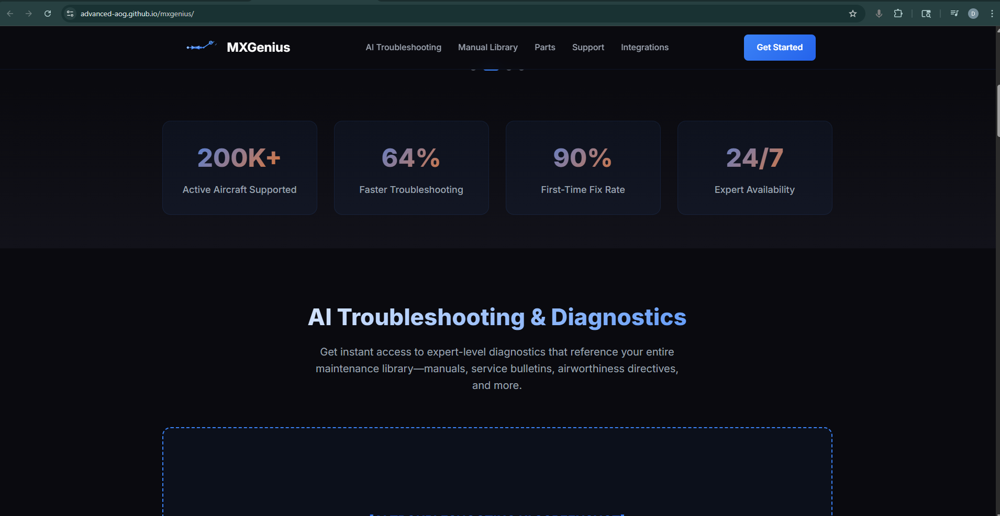
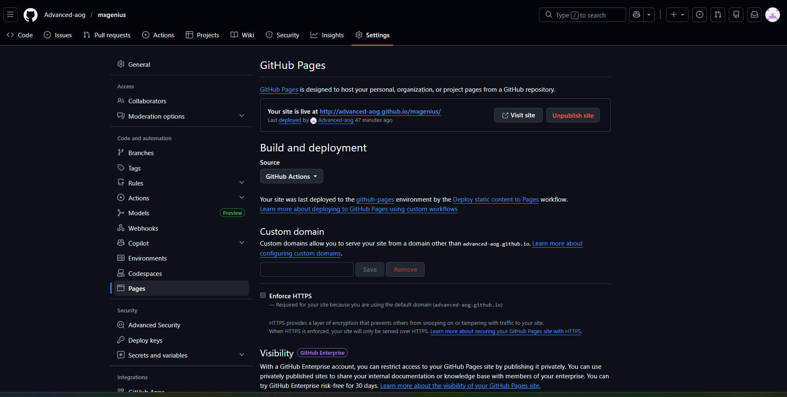
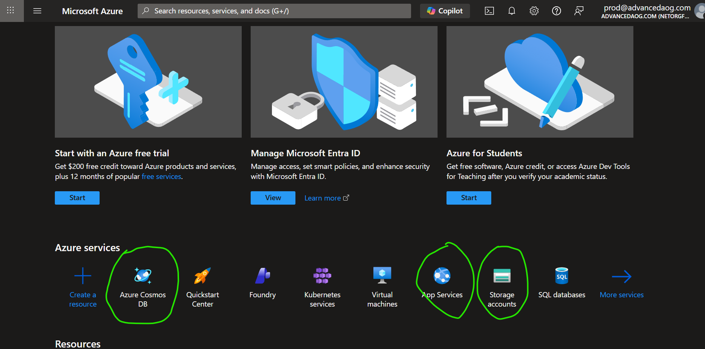

# Weekly Progress Report — Week 1
**Date Range:** Mar 16, 2026 — Mar 22, 2026
**Project:** Advanced AOG · Hermetic Labs

---

## Teaser: just for fun

🎬 **Video:** MxGenius.mp4

It's pretty rough and pretty short, but it helps in developing the UI and tightening the scope of the vision. Feel free to holler out if you have any suggestions, but I'll be using this just as a placeholder until you get an actual media company on it, or however it's handled.

---

## Site live under free account for testing before launch

[https://advanced-aog.github.io/mxgenius/](https://advanced-aog.github.io/mxgenius/)

This will serve as a mock-up, something public-facing, and will eventually connect to Azure to create profiles for paying customers. Apart from the app.

---

## Git Repository Setup

Git repo, good to go, fully ready to accept any of your URLs and any development tasks. I used assigned sign-in and password for uniformity.

---

## Azure Configuration

Azure also good to go. This won't come until later on in the project, but I highlighted the three services I'm most likely to need.

---

## JetNet Wrapup

:::scroll
::from Trish Lejano — JETNET Customer Support
::date March 18, 2026

Hello Dwayne,

We've set up your access to the JETNET API using the contact information provided. To help you get started, I've attached two key documents:

**API Design Document** — Full documentation of the API structure and functionality
**Customer API V2 Access Guide** — A quick-start overview including how to generate a token and begin making requests.
**Swagger:** https://customer.jetnetconnect.com/swagger/index.html

You should receive an email invitation shortly to set up your API login. That email will include a link to create your password and access your account.

Let us know if you have any questions — we're here to support you every step of the way.

::divider

::from Dwayne Tillman — Advanced AOG
::date March 20, 2026

Hi Trish,

Thank you for the warm welcome — everything with onboarding went smoothly, and I'm fully set up on my end.

I did have a quick follow-up question regarding the API usage and any associated costs. I want to make sure I'm approaching this correctly from the start. If possible, I'd prefer to work against the live API endpoints for development and testing, but I completely understand if there's a recommended approach to use the Swagger environment first before moving to production.

Could you please advise on the best path forward?

::divider

::from Trish Lejano — JETNET Customer Support
::date March 20, 2026

Hi Dwayne,

I checked with the team, and they advised that you can absolutely work against the live API endpoints. However, we generally recommend starting in Swagger to validate requests, understand response structures, and make sure you're hitting the right endpoints before moving into your application workflow.

From a practical standpoint:
— **Swagger** is best for testing queries and shaping payloads
— **Production** is best once your workflow is defined and ready to integrate

On pricing, the API is structured as a **flat annual subscription**. There's no usage-based billing on call volume. The only time costs would change is if you decide to expand into additional data domains or endpoints that aren't currently included (for example, Flight Data or History).

If helpful, I can arrange a walkthrough of the optimal setup based on what you're building so you're aligned from both a technical and data coverage standpoint.

::divider

::from Dwayne Tillman — Advanced AOG
::date March 20, 2026

Hi Trish,

I'm actually pretty far along in my workflow. Prior to getting API access, I spent some time working with the Swagger documentation directly and built out a simulator to test things via TestFlight on iOS. It's a very solid and user-friendly setup, which made that process smooth.

If I do run into any roadblocks, I'll definitely reach out. Otherwise, I should be in a good place to continue moving forward.

::divider

::from Trish Lejano — JETNET Customer Support
::date March 20, 2026

Thanks so much for letting me know. I will go ahead and resolve this ticket for now. However, if anything else comes up, please do not hesitate to reach back out.
:::end

Confirmed 0 cost for development.

---

*Prepared by Hermetic Labs for Advanced AOG*
