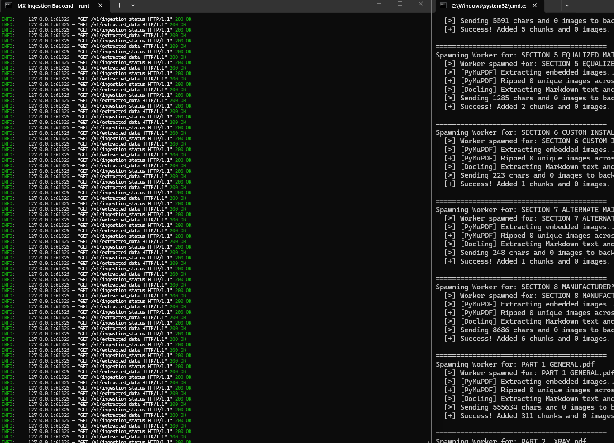
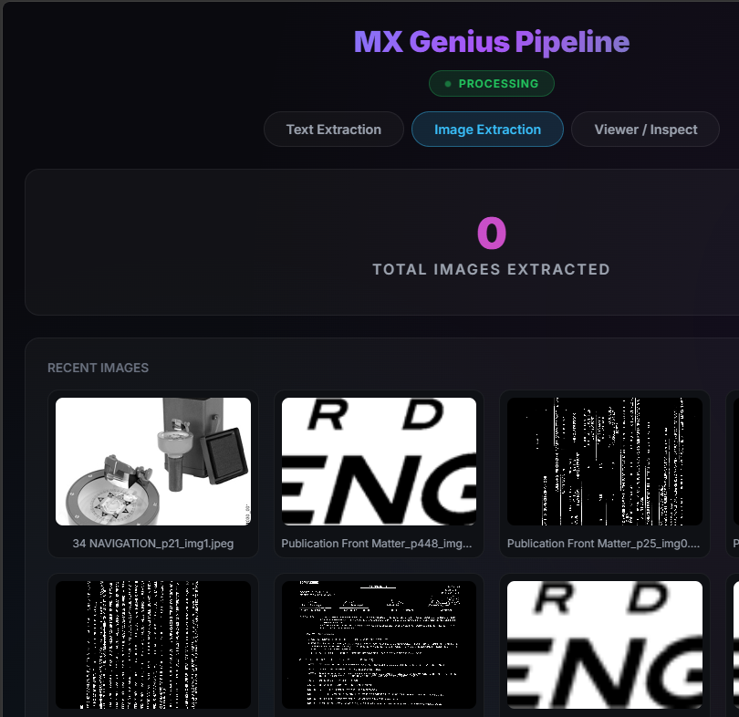
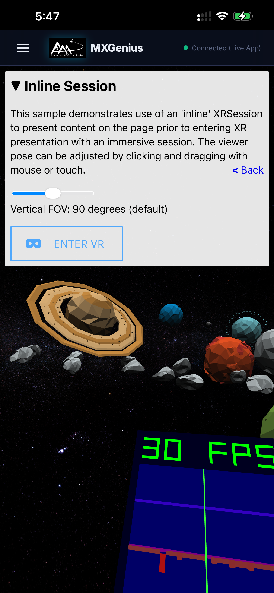

# Weekly Progress Report — Week 7
**Date Range:** Apr 27, 2026 — May 3, 2026
**Project:** Advanced AOG · Hermetic Labs

---

## Noda- This is great for large-scale planning and mapping out little details. It has the added benefit of being a collaborative thing, so we can jump in at any time together.

🎬 **Video:** noda.mp4
*Open for a session anytime you wanna work out something really complicated.*

## Gravity Sketch

🎬 **Video:** GravitySketch.mp4
*This will be an actual AdvancedAOG workspace so that you can align with some of the accelerator programs.*

## Meta/Facebook scale and servers

🎬 **Video:** Meta Facebook.mp4
*Just say the word and I'll make you an official advanced AOG beta channel track on the MetaQuest Facebook servers.*

## MxGenius Model Data Curation

*Slow and steady process. I know it looks painful, but these little drips eventually fill up, and we only have to do it once.*

## pipeline

![Since the process is so long, I created a pipeline just to monitor it to see when it fails, to see how it handles the failure, so that we're not doing double work down the line. Again, I know 0.2 doesn't look like a lot, but given what it's gonna do and what data it's extracting, it's moving at a really good steady pace.   And I'm obviously refactoring and looking for different speed gains along the way. I just can't disturb the process too much. It's like opening the oven door and checking on what you're baking and letting out the heat.](pipeline.png)
*Since the process is so long, I created a pipeline just to monitor it to see when it fails, to see how it handles the failure, so that we're not doing double work down the line. Again, I know 0.2 doesn't look like a lot, but given what it's gonna do and what data it's extracting, it's moving at a really good steady pace.   And I'm obviously refactoring and looking for different speed gains along the way. I just can't disturb the process too much. It's like opening the oven door and checking on what you're baking and letting out the heat.*

## image extract and tag

*There's a separate section in the pipeline to extract the photos and to tag them for recall later, so that the data doesn't get partitioned in processing, and a certain chunk of data can be linked to a certain image in the processing of the AI.*

## Along the way

*to put it in perspective, it may say one PDF, but it's deceptive. One of those has pages and pages of data. In fact, so much so that I should be able to hopefully start testing its knowledge base by next week or in the middle of the week after, You'll be surprised what it can do even with 1% of data processed, we can test it along the way, so we don't have to wait until the very end.*

## I just wanted to highlight that I downloaded the nuts and bolts of the Apple Vision SDK, which is their official software for making your app Apple Vision Pro capable. You can test this just on your phone. It'll say that your Apple Vision isn't connected, but I left it there so you can test out some of the examples just to know that your app is compatible with it. If you do want to pick up an Apple Vision Pro, you can surely test it out. And if there's any bugs, I can work it out. But the fact that it works on the  phone is a good sign.

## Remote - Reliable - Resilient.

![This one's a little different. At first glance, it doesn't look that big, but it actually is.  Right now, most AI—like ChatGPT or Claude—runs in the cloud on massive servers. You're essentially renting intelligence. But the market is starting to shift toward something called edge compute—AI that runs locally, on-device.  The problem is, businesses don't lean into it much yet because it's hard to meter and harder to build a clean ROI model around. But if you can figure that part out, you're ahead of the next wave.  The idea here is simple: your AI starts off dumb as a box of rocks—but it's yours. And as it ingests the data I'm processing in the backend, it'll will start to approach 'Genius' level. Not generic intelligence—owned intelligence.  That's where the real value is.  ** Look for test flight version 2, and remember this is V1 of ai and very unstable.   This is just to get you into airplane mode. I'll look forward to your feedback.Also includes a custom voice model, so technically you have two, three AIs if you incorporate the speech-to-text. (whisper)**](Ai.png)
*This one's a little different. At first glance, it doesn't look that big, but it actually is.  Right now, most AI—like ChatGPT or Claude—runs in the cloud on massive servers. You're essentially renting intelligence. But the market is starting to shift toward something called edge compute—AI that runs locally, on-device.  The problem is, businesses don't lean into it much yet because it's hard to meter and harder to build a clean ROI model around. But if you can figure that part out, you're ahead of the next wave.  The idea here is simple: your AI starts off dumb as a box of rocks—but it's yours. And as it ingests the data I'm processing in the backend, it'll will start to approach 'Genius' level. Not generic intelligence—owned intelligence.  That's where the real value is.  ** Look for test flight version 2, and remember this is V1 of ai and very unstable.   This is just to get you into airplane mode. I'll look forward to your feedback.Also includes a custom voice model, so technically you have two, three AIs if you incorporate the speech-to-text. (whisper)***

---

*Prepared by Hermetic Labs for Advanced AOG*
